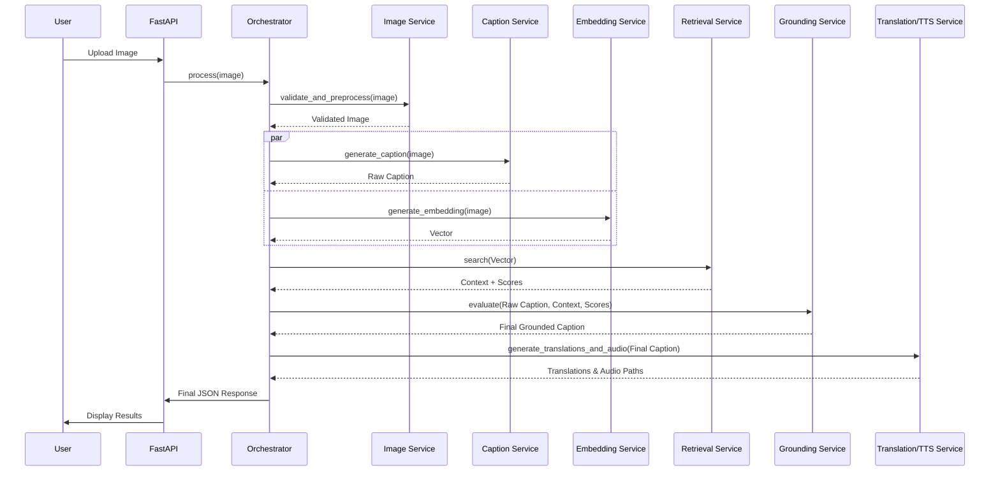

# 03_ENTERPRISE_SOFTWARE_ARCHITECTURE.md
Version 1.0
Status: LOCKED

## PART 1 — Enterprise Software Architecture

### Table of Contents
1. [Architecture Philosophy](#1-architecture-philosophy)
2. [Why This Architecture?](#2-why-this-architecture)
3. [Enterprise Design Goals](#3-enterprise-design-goals)
4. [Architectural Principles](#4-architectural-principles)
5. [High-Level Architecture](#5-high-level-architecture)
6. [Layered Architecture](#6-layered-architecture)
7. [Core Components](#7-core-components)
8. [Component Responsibilities](#8-component-responsibilities)
9. [Communication Flow](#9-communication-flow)
10. [Request Lifecycle](#10-request-lifecycle)
11. [AI Lifecycle](#11-ai-lifecycle)
12. [Scalability Philosophy](#12-scalability-philosophy)

### 1. Architecture Philosophy
#### 1.1 Vision
OmniVision is not designed as a simple machine learning demonstration or an academic prototype. Instead, it is architected as a modular, production-inspired AI platform whose primary application is intelligent image caption generation.

The architecture prioritizes:
- Modularity
- Extensibility
- Explainability
- Maintainability
- Scalability
- Reliability
- Accessibility

Every subsystem is designed to be independently testable, replaceable, and reusable.

#### 1.2 Architectural Mindset
Many student AI projects follow a linear implementation:
`Upload Image` → `Run Model` → `Display Caption`
While functional, such designs tightly couple the user interface, AI model, and business logic, making the system difficult to extend or maintain.
OmniVision adopts a service-oriented architecture inspired by modern AI platforms. Each component performs a single responsibility, and coordination is handled by a dedicated orchestration layer.

#### 1.3 Engineering Goals
The architecture is designed to achieve the following objectives:
- Produce accurate image captions.
- Enhance captions with contextual information only when appropriate.
- Avoid hallucinations through confidence-based grounding.
- Support multilingual output.
- Improve accessibility through speech synthesis.
- Provide explainability for AI decisions.
- Allow future model upgrades with minimal code changes.
- Enable domain expansion through reusable knowledge packs.

### 2. Why This Architecture?
Several architectural styles were evaluated before selecting the final design.

**Option 1: Monolithic Script**
All functionality implemented within a single application.
- *Advantages*: Simple to develop. Suitable for small demonstrations.
- *Disadvantages*: Poor maintainability. Difficult testing. Tight coupling. Low scalability.
- *Decision*: Rejected.

**Option 2: Traditional Three-Tier Architecture**
`Presentation Layer` → `Business Logic` → `AI Models`
- *Advantages*: Better organization.
- *Disadvantages*: AI services remain tightly coupled. Difficult to replace models independently. Limited orchestration capabilities.
- *Decision*: Partially suitable but insufficient for a multimodal AI platform.

**Option 3: Modular AI Platform (Selected)**
`Presentation Layer` → `API Layer` → `AI Orchestration Layer` → `Independent AI Services` → `Infrastructure Layer`
- *Advantages*: Highly modular. Easily extensible. Production-inspired. Clean separation of concerns. Supports multiple AI models. Facilitates testing and maintenance.
- *Decision*: Selected.

### 3. Enterprise Design Goals
The architecture is guided by the following goals:
**G1. Modularity**: Every service performs a single well-defined function.
**G2. Loose Coupling**: Services communicate through interfaces rather than direct dependencies.
**G3. High Cohesion**: Each module contains closely related functionality.
**G4. Explainability**: The system should expose how captions are generated and enhanced.
**G5. Reliability**: Failures in optional components must not interrupt the primary caption generation pipeline.
**G6. Extensibility**: Future features should require minimal architectural changes.
**G7. Maintainability**: The codebase should remain understandable and easy to evolve.

### 4. Architectural Principles
The following principles govern all implementation decisions.

**4.1 Single Responsibility Principle**
Every service has one responsibility. Examples: Caption Service generates captions; Retrieval Service performs retrieval; Translation Service translates text. Services do not perform unrelated tasks.

**4.2 Separation of Concerns**
The frontend does not contain AI logic. The API layer does not implement business rules. The orchestration layer coordinates workflows. AI services execute specialized tasks. Infrastructure provides shared capabilities.

**4.3 Dependency Inversion**
Business logic depends on abstractions rather than concrete implementations. This enables future replacement of BLIP with Florence or another captioning model, FAISS with another vector database, and IndicTrans2 with a different translation engine, without changing higher-level business logic.

**4.4 Configuration over Hardcoding**
System behavior should be configurable through environment variables and configuration files. Examples: Model names, Paths, Thresholds, Supported languages, Output directories.

**4.5 Graceful Degradation**
If optional features fail, the core functionality remains available. Examples: Translation failure should not prevent caption generation. Retrieval failure should return the raw caption. Speech synthesis failure should not block the response.

### 5. High-Level Architecture
The overall system architecture consists of five logical layers.
```
+------------------------------------------------------+
|                Presentation Layer                    |
|                 (Streamlit Dashboard)                |
+------------------------------------------------------+
                      │
                      ▼
+------------------------------------------------------+
|                     API Layer                        |
|               FastAPI REST Services                  |
+------------------------------------------------------+
                      │
                      ▼
+------------------------------------------------------+
|               AI Orchestration Layer                 |
|             Request Coordinator Engine               |
+------------------------------------------------------+
                      │
                      ▼
+------------------------------------------------------+
|                AI Service Layer                      |
| Caption | Embedding | Retrieval | Grounding | TTS    |
+------------------------------------------------------+
                      │
                      ▼
+------------------------------------------------------+
|             Infrastructure Layer                     |
| Model Manager | Config | Logging | Storage | FAISS   |
+------------------------------------------------------+
```
Each layer has clearly defined responsibilities and interacts only with adjacent layers.

### 6. Layered Architecture
**6.1 Presentation Layer**
Responsibilities: Accept image uploads. Display uploaded image. Show generated captions. Display contextual information. Play generated audio. Present explainability metrics. Display progress indicators. Handle user-facing errors.
Technology: Streamlit. The presentation layer contains no AI inference or business logic.

**6.2 API Layer**
Responsibilities: Receive HTTP requests. Validate request structure. Invoke the AI Orchestrator. Return structured JSON responses. Handle HTTP status codes.
Technology: FastAPI. Routes remain lightweight and contain no business logic.

**6.3 AI Orchestration Layer**
The orchestration layer acts as the central coordinator of the AI pipeline.
Responsibilities: Manage request flow. Invoke required services. Coordinate service execution. Apply business rules. Handle failures. Aggregate outputs. Construct the final response.
This layer ensures that individual AI services remain independent and unaware of one another.

**6.4 AI Service Layer**
This layer consists of specialized services. Each service has a single responsibility and can be independently developed, tested, or replaced.
Services include: Image Service, Caption Service, Embedding Service, Retrieval Service, Grounding Service, Translation Service, TTS Service.
The AI Orchestrator coordinates these services.

**6.5 Infrastructure Layer**
The infrastructure layer provides shared capabilities used across the platform.
Components include: Model Manager, Configuration Manager, Logging System, File Storage, Knowledge Base, Vector Index, Utility Modules.
These components support the AI services but do not contain business logic.

### 7. Core Components
The architecture consists of the following primary components: Streamlit Dashboard, FastAPI Server, AI Orchestrator, Image Service, Caption Service, Embedding Service, Retrieval Service, Grounding Service, Translation Service, Text-to-Speech Service, Model Manager, Knowledge Base, FAISS Index, Logging Framework, Configuration Manager.
Each component is designed to be independently testable and replaceable.

### 8. Component Responsibilities
- **Streamlit Dashboard**: Acts as the user interface. Provides image upload, results display, explainability panel, and audio playback.
- **FastAPI**: Acts as the communication gateway. Responsible for request validation, routing, JSON responses, error handling.
- **AI Orchestrator**: Coordinates all AI services. Determines which services execute, execution order, failure recovery, final response construction.
- **Image Service**: Responsible for image validation, preprocessing, normalization, conversion.
- **Caption Service**: Responsible solely for generating visual captions.
- **Embedding Service**: Responsible solely for generating semantic image embeddings.
- **Retrieval Service**: Responsible solely for searching the FAISS index. Returning ranked contextual entries.
- **Grounding Service**: Responsible for confidence evaluation. Caption enrichment. Fallback decisions.
- **Translation Service**: Responsible for multilingual caption generation.
- **TTS Service**: Responsible for speech generation.
- **Model Manager**: Responsible for loading AI models. Caching models. Managing inference resources. No other component loads models directly.

### 9. Communication Flow
Communication always follows a single direction:
Streamlit → FastAPI → AI Orchestrator → AI Services → Infrastructure → AI Services → AI Orchestrator → FastAPI → Streamlit
Services never call each other directly.

### 10. Request Lifecycle
A typical request proceeds through the following stages:
1. User uploads an image.
2. Streamlit sends the image to FastAPI.
3. FastAPI validates the request.
4. AI Orchestrator receives the request.
5. Image Service preprocesses the image.
6. Caption Service generates the raw caption.
7. Embedding Service generates semantic embeddings.
8. Retrieval Service searches for contextual knowledge.
9. Grounding Service evaluates confidence and enriches or falls back.
10. Translation Service produces multilingual captions.
11. TTS Service generates speech.
12. AI Orchestrator assembles the final response.
13. FastAPI returns JSON.
14. Streamlit displays results.

### 11. AI Lifecycle
Every AI request follows the same lifecycle:
Input received → Validation → Model inference → Context retrieval (if applicable) → Confidence evaluation → Caption grounding → Translation → Speech generation → Response assembly → Logging
This standardized lifecycle simplifies debugging, monitoring, and future enhancements.

### 12. Scalability Philosophy
OmniVision is designed to evolve without requiring architectural redesign. Future enhancements—such as replacing BLIP with a newer captioning model, introducing additional knowledge packs, supporting more languages, or integrating a cloud-hosted vector database—should be achievable by extending or replacing individual services while keeping the overall architecture unchanged.

---

## PART 2 — Internal Operations & Implementation Architecture

### Table of Contents (Part 2)
13. [AI Orchestrator](#13-ai-orchestrator)
14. [Model Manager](#14-model-manager)
15. [Service Interaction Design](#15-service-interaction-design)
16. [AI Pipeline (Internal)](#16-ai-pipeline-internal)
17. [Sequence Diagrams (Text-Based)](#17-sequence-diagrams-text-based)
18. [Confidence Gate Logic](#18-confidence-gate-logic)
19. [Explainability Engine](#19-explainability-engine)
20. [Request State Machine](#20-request-state-machine)
21. [Error Propagation Strategy](#21-error-propagation-strategy)
22. [Complete Internal Data Flow](#22-complete-internal-data-flow)
23. [Knowledge Pack Framework (Enhancement)](#23-knowledge-pack-framework-enhancement)
24. [Response Builder](#24-response-builder)

### 13. AI Orchestrator
The AI Orchestrator is the central brain of the system, residing in `backend/app/orchestrator/request_coordinator.py`. 

**Orchestration Workflow**
1. **Validation Phase**: Directs Image Service to validate inputs.
2. **Parallel/Sequential Inference Phase**: 
   - Invokes `Caption Service` to obtain visual semantics.
   - Invokes `Embedding Service` to obtain semantic vectors.
3. **Retrieval Phase**: Passes embeddings to `Retrieval Service`.
4. **Decision Phase**: Invokes `Grounding Service` to apply rules based on retrieval scores.
5. **Downstream Execution**: Passes the grounded/raw caption to `Translation Service` and `TTS Service`.
6. **Response Phase**: Assembles the results via the `Response Builder`.

**Failure Handling & Timeout Strategy**
- Timeout limits are set on external inferences to avoid hanging requests.
- Retry policies are implemented using exponential backoff (e.g., max 2 retries for TTS failure).
- If a downstream service (like TTS) fails completely after retries, the Orchestrator catches the exception, logs it, and continues to the `Response Builder`, marking `tts_status: failed`.

### 14. Model Manager
Residing at `backend/app/managers/model_manager.py`, the Model Manager centralizes the AI model lifecycle. It prevents Out-Of-Memory (OOM) errors and redundant loading.

**Core Mechanisms**
- **Singleton Architecture**: Only one instance of the Model Manager exists across the FastAPI app lifecycle.
- **Lazy Loading**: Models (BLIP, CLIP, IndicTrans2, XTTS) are not loaded at application boot. They are loaded into VRAM only when first requested.
- **Staged Execution (Memory Management)**: For constrained environments (e.g., 4GB VRAM RTX 3050), the manager implements a swap logic. If loading XTTS would exceed memory, it flushes the BLIP model to CPU/Disk, runs garbage collection `gc.collect()`, empties CUDA cache `torch.cuda.empty_cache()`, and then loads XTTS.
- **Model Caching**: Frequently used models are kept in memory until memory pressure triggers a cleanup.

### 15. Service Interaction Design
Services do not hold references to each other. They interact solely through the Orchestrator via well-defined Pydantic interfaces.

- **Bad Design**: `CaptionService` calls `TranslationService.translate(caption)`
- **OmniVision Design**:
  ```python
  raw_caption = caption_service.generate(image)
  translated = translation_service.translate(raw_caption.text)
  ```
This ensures high cohesion and loose coupling. A developer can modify `translation_service.py` without touching the caption logic.

### 16. AI Pipeline (Internal)
The pipeline strictly enforces the following execution order and contracts:

1. **Input**: `UploadFile` (FastAPI)
2. **Validation**: Output is `ValidatedImage` (PIL Image + metadata).
3. **Caption Generation**: Output is `RawCaption` (string text).
4. **Embedding Generation**: Output is `ImageEmbedding` (Vector array).
5. **Retrieval**: Output is `RetrievalResult` (List of context strings + Similarity Scores).
6. **Confidence Evaluation**: Boolean flag `is_confident` based on Threshold `T`.
7. **Grounding**: Output is `FinalCaption` (string).
8. **Translation**: Output is `TranslationDict` (e.g., `{"hi": "...", "te": "..."}`).
9. **Speech**: Output is `AudioPaths` (e.g., `{"en": "/path.wav", ...}`).
10. **Response Assembly**: Output is a JSON-serializable `OmniVisionResponse`.

### 17. Sequence Diagrams (Text-Based)


### 18. Confidence Gate Logic
One of OmniVision's strongest differentiators is the Confidence Gate. Instead of blindly grounding every caption, which causes hallucinations, we evaluate retrieval quality.

**Algorithm:**
```python
THRESHOLD = config.GROUNDING_SIMILARITY_THRESHOLD # e.g., 0.75

if max(similarity_scores) >= THRESHOLD:
    # Reliable knowledge found.
    final_caption = LLM_combine(raw_caption, retrieved_context)
    grounding_applied = True
else:
    # No reliable knowledge. Avoid hallucination.
    final_caption = raw_caption
    grounding_applied = False
```
*Why this threshold?* It prevents the platform from forcing incorrect contextual associations (e.g., labeling a generic modern bridge as the "Howrah Bridge" just because it was the closest vector match in a sparse knowledge base).

### 19. Explainability Engine
The system does not treat the AI as a black box. The payload returned to the Presentation Layer includes an `explainability` node.

**Explainability Payload Example:**
```json
"explainability": {
  "raw_caption": "A stone structure with pillars.",
  "top_retrieved_entity": "Sanchi Stupa",
  "similarity_score": 0.82,
  "threshold_used": 0.75,
  "grounding_applied": true,
  "reasoning": "Similarity score (0.82) exceeded threshold (0.75). Caption was enriched with heritage knowledge."
}
```
This data is parsed by the Streamlit frontend to render an interactive "AI Decision Timeline" component.

### 20. Request State Machine
Every request generates a unique UUID trace and passes through the following states, tracked in the Orchestrator's logger:
1. `RECEIVED`
2. `VALIDATED`
3. `PROCESSING_VISION` (BLIP/CLIP active)
4. `RETRIEVING_KNOWLEDGE` (FAISS active)
5. `GROUNDING` (Decision engine active)
6. `TRANSLATING`
7. `GENERATING_AUDIO`
8. `COMPLETED` (or `FAILED`)

### 21. Error Propagation Strategy
Errors are caught gracefully to prevent full-system crashes. 
- **Critical Failures** (e.g., Image Service fails to parse image, BLIP crashes): Orchestrator terminates the request, returns HTTP 400/500 with a clean error message. State -> `FAILED`.
- **Non-Critical Failures** (e.g., Translation Service throws a timeout, TTS model fails to load): Orchestrator catches the error, sets the field to `null` or logs a warning, and continues. State -> `COMPLETED_WITH_WARNINGS`.

### 22. Complete Internal Data Flow
The data flow payload moving through the Orchestrator is a Pydantic Model (e.g., `ProcessingContext`):
```python
class ProcessingContext(BaseModel):
    request_id: str
    image_path: str
    validated: bool = False
    raw_caption: Optional[str] = None
    embedding: Optional[List[float]] = None
    retrieved_entries: List[KnowledgeEntry] = []
    grounding_applied: bool = False
    final_caption: Optional[str] = None
    translations: Dict[str, str] = {}
    audio_paths: Dict[str, str] = {}
    errors: List[str] = []
```
This object accumulates state. It is passed into the `Response Builder` at the end to generate the standard API response.

### 23. Knowledge Pack Framework (Enhancement)
Instead of a monolithic FAISS index, OmniVision supports pluggable Knowledge Packs. 
**Structure:**
```
knowledge_base/
├── heritage_pack/    (Index & JSON)
├── wildlife_pack/    (Index & JSON)
└── custom_pack/      (Index & JSON)
```
In `backend/app/config/settings.py`, an admin can define `ACTIVE_KNOWLEDGE_PACKS = ["heritage_pack"]`. The Retrieval Service dynamically merges or selects indices at boot time. This demonstrates scalability across different domains.

### 24. Response Builder
The Response Builder isolates the API response formatting logic from the Orchestrator workflow.
**Responsibilities:**
- Converts the `ProcessingContext` into the final `OmniVisionResponse` schema.
- Computes total request processing time (metadata).
- Attaches the server version and active model parameters for debugging.
- Ensures all paths (like audio URLs) are correctly mapped for frontend retrieval.
