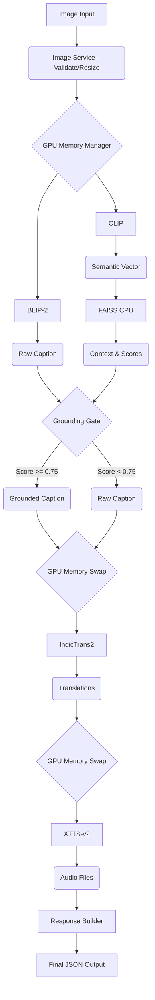

# 06_AI_PIPELINE_SPECIFICATION.md
Version 1.0
Status: LOCKED

## 1. Introduction
This document is the engineering core of the OmniVision platform. It details the exact AI pipeline execution order, tensor lifecycles, and memory management strategies required to run state-of-the-art multimodal AI models (BLIP-2, CLIP, IndicTrans2, and XTTS) sequentially on consumer-grade hardware (specifically, an Nvidia RTX 3050 with 4GB VRAM).

## 2. The OmniVision Pipeline Architecture
The pipeline is a sequential, staged process orchestrated by the `RequestCoordinator`. Because VRAM is limited to 4GB, **concurrent model execution is strictly prohibited**. 

### 2.1 Pipeline Stages
1. Image Preprocessing
2. Visual Caption Generation (BLIP-2)
3. Semantic Embedding Generation (CLIP)
4. Knowledge Retrieval (FAISS)
5. Confidence Gate & Grounding
6. Translation (IndicTrans2)
7. Speech Synthesis (XTTS)
8. Response Assembly

## 3. Stage 1: Image Preprocessing
**Component:** `ImageService`
**Input:** Raw image binary (from HTTP `UploadFile`)
**Output:** Validated `PIL.Image` and Normalized Tensor.

- **Validation:** Ensures file is an image (`image/jpeg`, `image/png`).
- **Resizing:** Images are aggressively downscaled if they exceed 1024x1024 to prevent memory blowouts during CNN/ViT encoding.
- **Conversion:** Forces RGB format to drop alpha channels which crash Vision Transformers.

## 4. Stage 2: Visual Caption Generation (BLIP-2)
**Component:** `CaptionService`
**Model:** `Salesforce/blip2-opt-2.7b`
**VRAM Footprint:** ~1.8GB (Using 4-bit quantization).

### 4.1 Inference Logic
1. The Orchestrator requests BLIP from `ModelManager`.
2. The image is passed through the `Blip2Processor` to generate `pixel_values`.
3. `model.generate()` is called with `max_new_tokens=40` for short captions, and `max_new_tokens=80` for detailed captions (prompt: "Describe this image in detail:").
4. Output tensor is decoded back to a string (the "Raw Caption").

### 4.2 Tensor Lifecycle & Cleanup
Once the text is decoded, the input and output tensors are immediately deleted from GPU memory:
```python
del pixel_values
del generated_ids
torch.cuda.empty_cache()
```

## 5. Stage 3: Semantic Embedding Generation (CLIP)
**Component:** `EmbeddingService`
**Model:** `openai/clip-vit-base-patch32`
**VRAM Footprint:** ~600MB.

### 5.1 Inference Logic
1. The Orchestrator requests CLIP from `ModelManager`.
2. The *same* preprocessed image is passed to `CLIPProcessor`.
3. `model.get_image_features()` generates a 512-dimensional semantic vector.
4. The vector is normalized (`L2 normalization`) to ensure accurate cosine similarity during FAISS retrieval.

## 6. Stage 4: Knowledge Retrieval (FAISS)
**Component:** `RetrievalService`
**Data Structure:** CPU-bound FAISS Index (IndexFlatIP for Inner Product/Cosine Similarity).

### 6.1 Search Logic
- The normalized 512-dim CLIP embedding is passed to FAISS.
- `index.search(query_vector, k=3)` retrieves the top 3 closest knowledge entries from the loaded Knowledge Pack.
- The service returns the text entries and their exact similarity scores (0.0 to 1.0).

## 7. Stage 5: Confidence Gate & Grounding
**Component:** `GroundingService` (CPU only).
This is the intellectual differentiator of OmniVision.

### 7.1 The Confidence Algorithm
```python
T = config.GROUNDING_THRESHOLD  # Configured to 0.75
top_score = retrieval_result.scores[0]

if top_score >= T:
    # High confidence: Entity recognized.
    # Combine Raw Caption with Retrieved Knowledge using a simple rule-based approach or lightweight LLM call.
    final_caption = f"{raw_caption} Context: {retrieval_result.entries[0]}"
    grounding_applied = True
else:
    # Low confidence: Entity unknown.
    final_caption = raw_caption
    grounding_applied = False
```

### 7.2 Fallback Strategy
By refusing to ground captions when `top_score < T`, the platform prevents hallucinations. An image of a generic dog will simply output the BLIP caption, whereas an image of the "Taj Mahal" (score > 0.85) will output the BLIP caption enriched with historical context.

## 8. Stage 6: Translation
**Component:** `TranslationService`
**Model:** `ai4bharat/indictrans2-en-indic-dist-200M`
**VRAM Footprint:** ~400MB.

### 8.1 Inference Logic
1. Orchestrator requests IndicTrans2 from `ModelManager`.
2. The `Final Caption` (Grounded or Raw) is tokenized.
3. The model generates Hindi and Telugu translations sequentially.
4. Tensors are deleted, and `torch.cuda.empty_cache()` is called.

## 9. Stage 7: Speech Synthesis (XTTS)
**Component:** `TTSService`
**Model:** `tts_models/multilingual/multi-dataset/xtts_v2`
**VRAM Footprint:** ~2GB.

### 9.1 Inference Logic
1. This is the heaviest model. `ModelManager` will likely unload BLIP entirely from VRAM to make room for XTTS.
2. The service receives the Hindi, Telugu, and English text.
3. It generates `.wav` files and saves them to `/static/audio/{uuid}_{lang}.wav`.
4. Returns the file paths.

## 10. Memory Management & GPU Swapping
The `ModelManager` orchestrates the swapping. 

**State 1 (Vision Phase):**
- VRAM: BLIP (1.8GB) + CLIP (0.6GB) = 2.4GB / 4GB. Safe.
**State 2 (Translation Phase):**
- VRAM: BLIP (1.8GB) + CLIP (0.6GB) + IndicTrans (0.4GB) = 2.8GB. Safe.
**State 3 (Audio Phase):**
- XTTS requires ~2GB. Loading it now would cause OOM (4.8GB > 4GB).
- `ModelManager` intercepts the request:
  - Unloads BLIP and CLIP from GPU (moves to CPU RAM).
  - Calls `gc.collect()` and `torch.cuda.empty_cache()`.
  - VRAM is now 0.4GB.
  - Loads XTTS (+2GB). Total VRAM = 2.4GB. Safe.

This staged execution is the only way to run this entire pipeline on an RTX 3050, and demonstrating this architecture is highly attractive to interviewers.

## 11. Performance Optimization
- **4-bit Quantization:** BLIP-2 is loaded using `bitsandbytes` `load_in_4bit=True`.
- **Distilled Models:** IndicTrans2 uses the distilled 200M parameter version instead of the massive base model.
- **CPU Offloading:** FAISS runs entirely on the CPU to save VRAM.
- **Lazy Loading:** Models are instantiated only upon the first request.

## 12. Pipeline Diagrams

